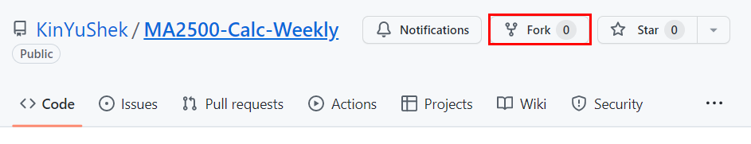
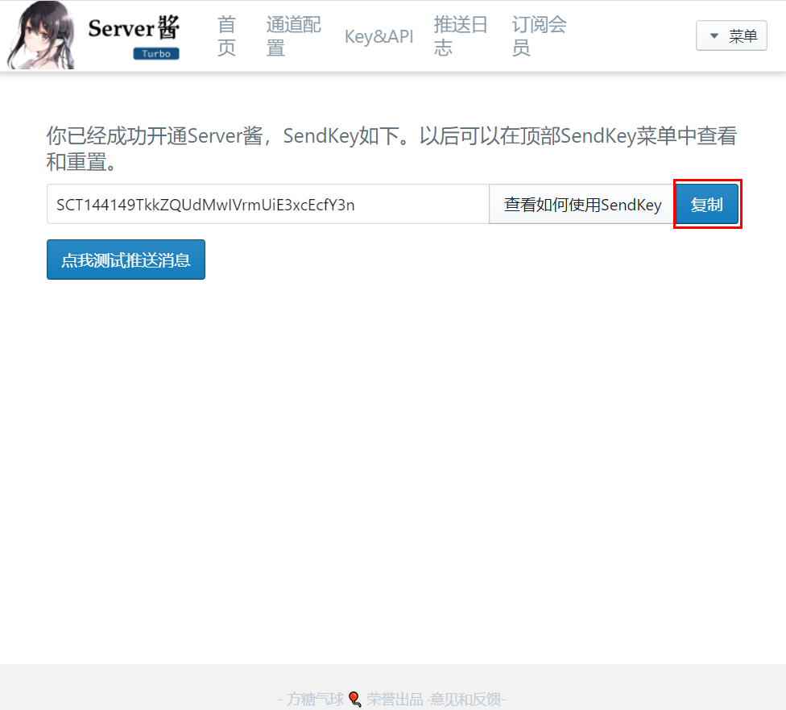
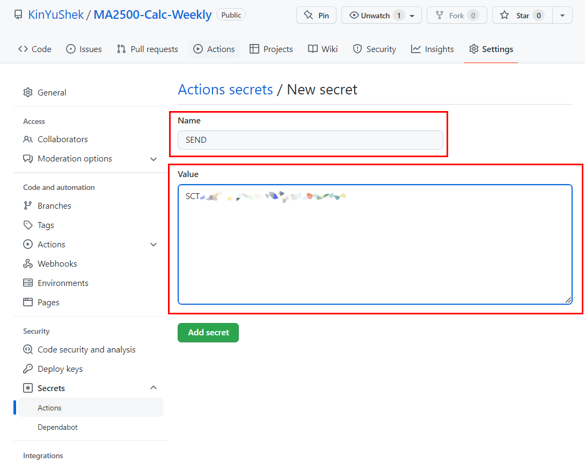
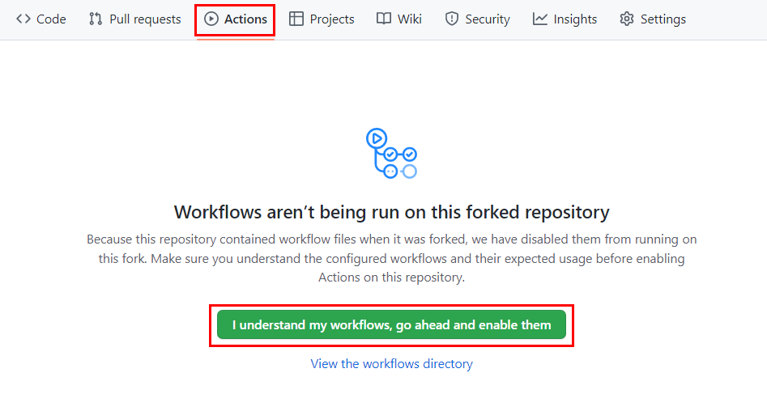
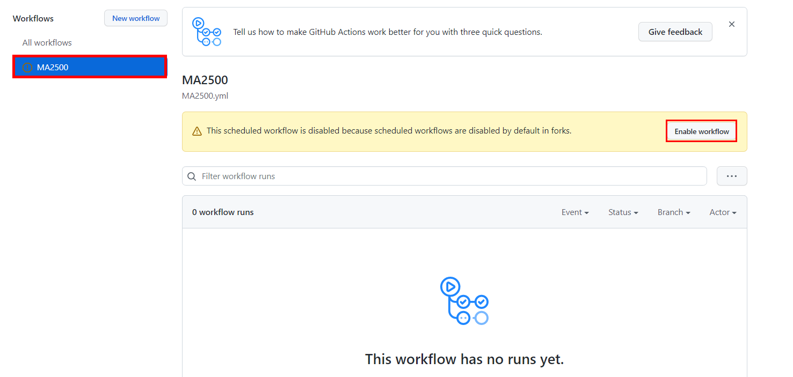
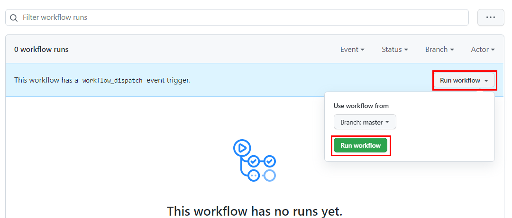

# MA2500每周推送
本项目可每周计算上证指数MA2500，并通过第三方微信服务号推送。
***项目仅供学习交流之用，请勿用于其它用途。***
项目地址：<https://github.com/KinYuShek/MA2500-Calc-Weekly>
## 特色
- 每周五18点计算上证指数MA2500。
- 支持在 GitHub Actions 或自建服务器（开发中）上使用
- 支持Server酱消息推送接口

## 使用

### I. 使用 GitHub Actions 
#### 0. 开始
点击本项目右上角的`Fork`

#### 1. 获取 SendKey
前往<https://sct.ftqq.com/sendkey>
微信扫码关注服务号登录后复制SendKey

#### 2. 添加 SEND Secret
在自己 Fork 后的项目的页面依次点击 `Settings`-`Secrets`-`Actions`-`New repository secret`

如图所示， `Name` 处输入 `SEND` ， `Value` 处粘贴SandKey
点击`Add secret`

#### 3.开启 Actions
如图所示

此时 Actions 开启成功，程序会在 **北京时间 (UTC+8) 每周五 18:00** 执行一次，如需修改执行时间，可在 `.github/workflows/MA2500.yml` 下修改

可以点击 `Run workflow` 测试提醒一下，确认可以正常执行。

### II. 使用自己的服务器
此方法适用于自己有服务器，或者在自己电脑上运行的用户，使用 GitHub Actions 的用户请跳过此部分

展开全文

开发中，详细信息请查看`server`分支

***本项目仅供学习交流之用，请勿用于其它用途。***

## Thanks
大鹅的MA2500
